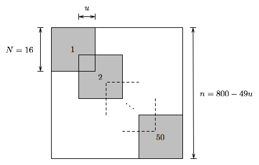

.. role:: raw-html(raw)
   :format: html

.. raw:: html

    

########## 
Benchmarks
##########

To assess the performance of our preliminary implementation of SMCP, we have conducted a series of numerical experiments. 
   

SDP solvers
===========

The following interior-point solvers were used in our experiments:

* Method **M1**   (SMCP 0.3a, feasible start solver with `kktsolver='chol'`)

* Method **M1c**  (SMCP 0.3a, feasible start solver with `kktsolver='chol'` and `solvers.options['cholmod']=True`)

* Method **M2**   (SMCP 0.3a, feasible start solver with `kktsolver='qr'`)

* CSDP 6.0.1

* DSDP 5.8

* SDPA 7.3.1

* SDPA-C 6.2.1 (binary dist.)

* SDPT3 4.0b (64-bit Matlab)

* SeDuMi 1.2 (64-bit Matlab)

Error measures
==============

We report DIMACS error measures when available. The six error measures are defined as:

.. math::
   
   \epsilon_1(X,y,S) &= \frac{\|\mathcal{A}(X) - b\|_2}{1+\|b\|_\infty} \\
   \epsilon_2(X,y,S) &= \max\left\{0,\frac{-\lambda_{\min}(X)}{1+\|b\|_\infty } \right\} \\
   \epsilon_3(X,y,S) &= \frac{\|\mathcal{A}^{\rm adj}(y)+S-C \|_F}{1+\|C\|_{\max}} \\
   \epsilon_4(X,y,S) &= \max\left\{0, \frac{-\lambda_{\min}(S)}{1+\|C\|_{\max}} \right\} \\
   \epsilon_5(X,y,S) &= \frac{C \bullet X - b^Ty}{1+|C\bullet X|+|b^Ty|} \\
   \epsilon_6(X,y,S) &= \frac{S\bullet X}{1+|C\bullet X|+|b^Ty|} 

Here :math:`\|C\|_{\max} = \max_{i,j} |C_{ij}|`, and :math:`C\bullet X = \mathbf{tr}(C^TX)`. 

Note that :math:`\epsilon_2(X,y,S)=0` and :math:`\epsilon_4(X,y,S)=0`
since all iterates :math:`(X,y,S)` satisfy :math:`X \in
\mathbf{S}_{V,c++}^n` and :math:`S \in \mathbf{S}_{V,++}^n`.

Experimental setup
====================

The following experiments were conducted on a desktop computer with an
Intel Core 2 Quad Q6600 CPU (2.4 GHz), 4 GB of RAM, and running Ubuntu
9.10 (64 bit).

The problem instances used in the experiments are available for
download :doc:`here <../testproblems/index>` and the SDPLIB problems are
available `here <http://www.nmt.edu/~borchers/sdplib>`_.

We use the least-norm solution to the set of equations :math:`A_i
\bullet X, i=1,\ldots,m,` as starting point when it is strictly
feasible, and otherwise we solve the phase I problem
   
.. math::

   \begin{array}{ll}
   \mbox{minimize}   & s	\\
   \mbox{subject to} & A_i \bullet X = b_i, \quad i=1,\ldots,m, \\
   & \mathbf{tr}(X) \leq M  \\
   & X + (s-\epsilon) I \succeq_{\rm c} 0, s \geq 0.
   \end{array}
     
Here :math:`\epsilon` is a small constant, and the constraint
:math:`\mathbf{tr}(X) \leq M` is added to bound the feasible set.

SDPs with band structure
===========================

We consider a family of SDP instances where the data matrices
:math:`C,A_1,\ldots,A_m` are of order :math:`n` and banded with a
common bandwidth :math:`2w+1`.

Experiment 1
----------------------

:math:`m=100` constraints, bandwidth :math:`11` (:math:`w=5`), and variable order :math:`n`

.. raw:: html

     <h4> Results </h4>
     <table><tr>
     <td> Show: </td>
     <td> <select onchange="ajaxpage('../_static/benchmarks/band_ex2_'+this.value+'.html','contentarea_2')">
     <option value="timeperiter">Avg. time per iteration</option>
     <option value="iterations">Iterations</option>
     <option value="time">Total time (seconds)</option>
     <option value="dimacs1">DIMACS error (1)</option>
     <option value="dimacs2">DIMACS error (2)</option>
     <option value="dimacs3">DIMACS error (3)</option>
     <option value="dimacs4">DIMACS error (4)</option> 
     <option value="dimacs5">DIMACS error (5)</option>  
     <option value="dimacs6">DIMACS error (6)</option>
     </select> </td>
     </tr></table>
     

     

Experiment 2
----------------------

order :math:`n = 500`, bandwidth :math:`7` (:math:`w=3`), and variable number of constraints :math:`m`

.. raw:: html

     <h4> Results </h4>
     <table><tr>
     <td> Show: </td>
     <td> <select onchange="ajaxpage('../_static/benchmarks/band_ex3_'+this.value+'.html','contentarea_3')">
     <option value="timeperiter">Avg. time per iteration</option>
     <option value="iterations">Iterations</option>
     <option value="time">Total time (seconds)</option>
     <option value="dimacs1">DIMACS error (1)</option>
     <option value="dimacs2">DIMACS error (2)</option>
     <option value="dimacs3">DIMACS error (3)</option>
     <option value="dimacs4">DIMACS error (4)</option> 
     <option value="dimacs5">DIMACS error (5)</option>  
     <option value="dimacs6">DIMACS error (6)</option>
     </select> </td>
     </tr></table>
     

     

The problem `band_n500_m800_w3` required a phase I (M1 311.5 sec.; M2 47.8 sec.). 
  
Experiment 3
----------------------

order :math:`n = 200`, :math:`m=100` constraints, and variable bandwidth :math:`2w+1`

.. raw:: html

     <h4> Results </h4>
     <table><tr>
     <td> Show: </td>
     <td> <select onchange="ajaxpage('../_static/benchmarks/band_ex1_'+this.value+'.html','contentarea_1')">
     <option value="timeperiter">Avg. time per iteration</option>
     <option value="iterations">Iterations</option>
     <option value="time">Total time (seconds)</option>
     <option value="dimacs1">DIMACS error (1)</option>
     <option value="dimacs2">DIMACS error (2)</option>
     <option value="dimacs3">DIMACS error (3)</option>
     <option value="dimacs4">DIMACS error (4)</option> 
     <option value="dimacs5">DIMACS error (5)</option>  
     <option value="dimacs6">DIMACS error (6)</option>
     </select> </td>
     </tr></table>
     

     

Two problems required a phase I: `band_n200_m100_w0` (M1 1.12 sec.; M2 0.53 sec.) and `band_n200_m100_w1` (M1 3.18 sec.; M2 1.45 sec.).

Matrix norm minimization
============================

We consider the matrix norm minimization problem

.. math::
   
   \mbox{minimize} \ \| F(x) + G \|_2 

where :math:`F(x) = x_1 F_1 + \cdots + x_r F_r` and :math:`G,F_i \in
\mathbf{R}^{p \times q}` are the problem data. The problem can be
formulated as an SDP:

.. math::
   
   \begin{array}{ll}
      \mbox{minimize} & t \\
      \mbox{subject to} & 
      \begin{bmatrix} t I & F(x) +G \\
      (F(x)+G)^T & tI 
      \end{bmatrix} \succeq 0.
   \end{array}

This SDP has dimensions :math:`m=r+1` and :math:`n = p + q`.  We
generate :math:`G` as a dense :math:`p\times q` matrix, and the
matrices :math:`F_i` are generated such that the number of nonzero
entries in each matrix is given by :math:`\max (1,dpq)` where the
parameter :math:`d \in [0,1]` determines sparsity. The locations of
nonzero entries in :math:`F_i` are random. Thus, the problem family is
parameterized by the tuple :math:`(p,q,r,d)`.

 
Experiment 4
-------------------- 

variable number of rows :math:`p`, :math:`q=10` columns, :math:`r=100` variables, and density :math:`d=1`  

.. raw:: html

     <h4> Results </h4>
     <table><tr>
     <td> Show: </td>
     <td> <select onchange="ajaxpage('../_static/benchmarks/mtxnorm_ex1_'+this.value+'.html','contentarea_4')">
     <option value="timeperiter">Avg. time per iteration</option>
     <option value="iterations">Iterations</option>
     <option value="time">Total time (seconds)</option>
     <option value="dimacs1">DIMACS error (1)</option>
     <option value="dimacs2">DIMACS error (2)</option>
     <option value="dimacs3">DIMACS error (3)</option>
     <option value="dimacs4">DIMACS error (4)</option> 
     <option value="dimacs5">DIMACS error (5)</option>  
     <option value="dimacs6">DIMACS error (6)</option>
     </select> </td>
     </tr></table>
     

     

Experiment 5
------------------------

:math:`p=400` rows, :math:`q=10` columns, :math:`r=200` variables, and variable density 

.. raw:: html

     <h4> Results </h4>
     <table><tr>
     <td> Show: </td>
     <td> <select onchange="ajaxpage('../_static/benchmarks/mtxnorm_ex2_'+this.value+'.html','contentarea_5')">
     <option value="timeperiter">Avg. time per iteration</option>
     <option value="iterations">Iterations</option>
     <option value="time">Total time (seconds)</option>
     <option value="dimacs1">DIMACS error (1)</option>
     <option value="dimacs2">DIMACS error (2)</option>
     <option value="dimacs3">DIMACS error (3)</option>
     <option value="dimacs4">DIMACS error (4)</option> 
     <option value="dimacs5">DIMACS error (5)</option>  
     <option value="dimacs6">DIMACS error (6)</option>
     </select> </td>
     </tr></table>
     

     

Experiment 6: 
-----------------------

:math:`p=400` rows, :math:`q=10` columns, variable number of variables :math:`r`, and density :math:`d=1`

.. raw:: html

     <h4> Results </h4>
     <table><tr>
     <td> Show: </td>
     <td> <select onchange="ajaxpage('../_static/benchmarks/mtxnorm_ex3_'+this.value+'.html','contentarea_6')">
     <option value="timeperiter">Avg. time per iteration</option>
     <option value="iterations">Iterations</option>
     <option value="time">Total time (seconds)</option>
     <option value="dimacs1">DIMACS error (1)</option>
     <option value="dimacs2">DIMACS error (2)</option>
     <option value="dimacs3">DIMACS error (3)</option>
     <option value="dimacs4">DIMACS error (4)</option> 
     <option value="dimacs5">DIMACS error (5)</option>  
     <option value="dimacs6">DIMACS error (6)</option>
     </select> </td>
     </tr></table>
     

     

Experiment 7: 
-----------------------

:math:`p + q=1000`, :math:`r=10` variables, and density :math:`d = 1`

.. raw:: html

     <h4> Results </h4>
     <table><tr>
     <td> Show: </td>
     <td> <select onchange="ajaxpage('../_static/benchmarks/mtxnorm_ex4_'+this.value+'.html','contentarea_7')">
     <option value="timeperiter">Avg. time per iteration</option>
     <option value="iterations">Iterations</option>
     <option value="time">Total time (seconds)</option>
     <option value="dimacs1">DIMACS error (1)</option>
     <option value="dimacs2">DIMACS error (2)</option>
     <option value="dimacs3">DIMACS error (3)</option>
     <option value="dimacs4">DIMACS error (4)</option> 
     <option value="dimacs5">DIMACS error (5)</option>  
     <option value="dimacs6">DIMACS error (6)</option>
     </select> </td>
     </tr></table>
     

     

Overlapping cliqes
=========================

We consider a family of SDPs which have an aggregate sparsity patterns :math:`V` with :math:`l` cliques of order :math:`N`. The cliques are given by

.. math::

   W_i = \{ (i-1)(N-u)+1,\ldots, (i-1)(N-u)+1+u \}, \quad i =1 ,\ldots, l

where :math:`u` (:math:`0 \leq u \leq N-1`) is the overlap between neighboring cliques. The sparsity pattern is illustrated below:

Note that :math:`u=0` corresponds to a block diagonal sparsity pattern and :math:`u=N-1` corresponds to a band pattern.

Experiment 8
-------------------------

:math:`m = 100` constraints, clique size :math:`N=16`, and variable overlap :math:`u`

.. raw:: html

     <h4> Results </h4>
     <table><tr>
     <td> Show: </td>
     <td> <select onchange="ajaxpage('../_static/benchmarks/cliqueoverlap_'+this.value+'.html','contentarea_8')">
     <option value="timeperiter">Avg. time per iteration</option>
     <option value="iterations">Iterations</option>
     <option value="time">Total time (seconds)</option>
     <option value="dimacs1">DIMACS error (1)</option>
     <option value="dimacs2">DIMACS error (2)</option>
     <option value="dimacs3">DIMACS error (3)</option>
     <option value="dimacs4">DIMACS error (4)</option> 
     <option value="dimacs5">DIMACS error (5)</option>  
     <option value="dimacs6">DIMACS error (6)</option>
     </select> </td>
     </tr></table>
     

     

SDPLIB problems
=====================

The following experiment is based on problem instances from :raw-html:`<a href="http://www.nmt.edu/~sdplib/">SDPLIB</a>`.

Experiment 9
------------------

SDPLIB problems with :math:`n \geq 500`

.. raw:: html

     <h4> Results </h4>
     <table><tr>
     <td> Show: </td>
     <td> <select onchange="ajaxpage('../_static/benchmarks/sdplib_'+this.value+'.html','contentarea_9')">
     <option value="timeperiter">Avg. time per iteration</option>
     <option value="iterations">Iterations</option>
     <option value="time">Total time (seconds)</option>
     <option value="dimacs1">DIMACS error (1)</option>
     <option value="dimacs2">DIMACS error (2)</option>
     <option value="dimacs3">DIMACS error (3)</option>
     <option value="dimacs4">DIMACS error (4)</option> 
     <option value="dimacs5">DIMACS error (5)</option>  
     <option value="dimacs6">DIMACS error (6)</option>
     </select> </td>
     </tr></table>
     

     

Three problems required a phase I: `thetaG11` (M1 227.2 sec.; M1c 184.4 sec.), `thetaG51` (M1 64.8 sec.: M1c 58.0 sec.), and `truss8` (M1 17.9 sec.; M1c 17.9 sec.).

Nonchordal sparsity patterns
===============================

The following problems are based on sparsity patterns from the `University of Florida Sparse Matrix Collection <http://www.cise.ufl.edu/research/sparse/matrices>`_ (UFSMC). We use as problem identifier the name `rsX` where `X` is the ID number of a sparsity pattern from UFSMC. Each problem instance has :math:`m` constraints and the number of nonzeros in the lower triangle of :math:`A_i` is :math:`\max\{1,\mathrm{round}(0.005 |V|)\}` where :math:`|V|` is the number of nonzeros in the lower triangle of the aggregate sparsity pattern :math:`V`, and :math:`C` has :math:`|V|` nonzeros.

Experiment 10
------------------

.. raw:: html

     <h4> Results </h4>
     <table><tr>
     <td> Show: </td>
     <td> <select onchange="ajaxpage('../_static/benchmarks/ufsmc_'+this.value+'.html','contentarea_10')">
     <option value="timeperiter">Avg. time per iteration</option>
     <option value="iterations">Iterations</option>
     <option value="time">Total time (seconds)</option>
     <option value="dimacs1">DIMACS error (1)</option>
     <option value="dimacs2">DIMACS error (2)</option>
     <option value="dimacs3">DIMACS error (3)</option>
     <option value="dimacs4">DIMACS error (4)</option> 
     <option value="dimacs5">DIMACS error (5)</option>  
     <option value="dimacs6">DIMACS error (6)</option>
     </select> </td>
     </tr></table>
     

     
     
     

